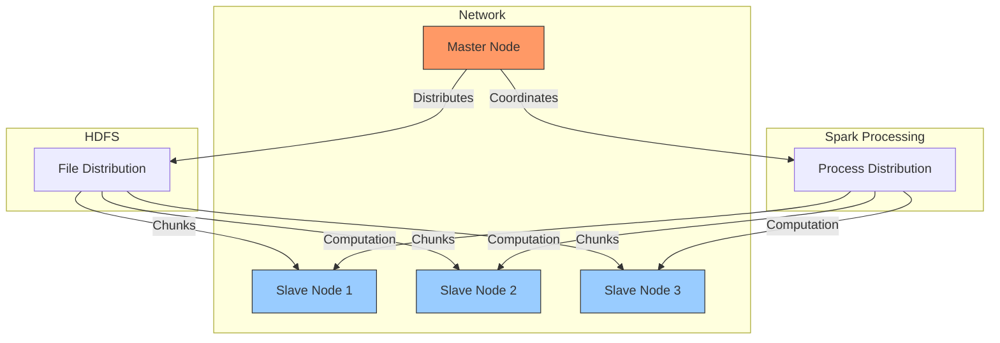

# Hadoop and Spark Configuration Project

This repository contains configuration files and examples for setting up and running Hadoop and Spark clusters. The project includes both configuration templates and example applications demonstrating various machine learning and data processing capabilities.

## Cluster Architecture and Distribution

This project implements a distributed computing environment where multiple devices in the same network are connected through Hadoop and SSH connections to form a cluster. Here's how it works:

- Multiple devices (3-5) in the same network are configured as a cluster
- One device is designated as the master node, while others serve as slave nodes
- File distribution is handled by HDFS (Hadoop Distributed File System)
- Process computation is distributed across all nodes using Apache Spark

### Distribution Diagram



### Key Features
1. **File Distribution**: When a file is shared in the cluster, HDFS automatically distributes it uniformly across all devices, ensuring redundancy and fast access.

2. **Distributed Processing**: When running processes using Spark:
   - Computation is uniformly distributed across all devices
   - Each node contributes its computational power
   - Results in significantly increased processing capabilities
   - Enables parallel processing of large-scale data

## Project Structure

```
.
├── spark-config.sh
├── spark-defaults.conf
├── spark-env.sh
├── workers
└── hadoop/
    ├── Configuration Files
    ├── data/
    └── name/
└── myspark/
    └── Example Applications
```

## Configuration Files

### Spark Configuration
- `spark-config.sh`: Shell script for Spark configuration
- `spark-defaults.conf`: Default configurations for Spark
- `spark-env.sh`: Environment variables for Spark
- `workers`: List of worker nodes in the cluster

### Hadoop Configuration
- `core-site.xml`: Core configuration settings
- `hdfs-site.xml`: HDFS configuration
- `mapred-site.xml`: MapReduce configuration
- `yarn-site.xml`: YARN configuration
- Various other configuration templates and examples

## Example Applications

The `myspark` directory contains various Java-based example applications demonstrating different machine learning and data processing capabilities:

### Machine Learning Examples
1. **K-Means Clustering**
   - `JavaKMeansExample.java`
   - Implementation of clustering algorithm

2. **Logistic Regression**
   - `JavaLogisticRegressionWithElasticNetExample.java`
   - Example with Elastic Net regularization

3. **Random Forest**
   - Located in `take1/`
   - Regression example implementation

4. **Decision Trees**
   - Located in `take2/`
   - Classification example

5. **SVD (Singular Value Decomposition)**
   - Located in `take4SVD/`
   - Matrix factorization example

6. **Model Selection**
   - Located in `take5/`
   - Train-validation split example
   - Includes sample linear regression data

### Data Processing
- `JavaWordCount.java`: Basic word counting example
- Various implementations in different "take" directories demonstrating different aspects of data processing

## Directory Structure

### Data Storage
- `data/datanode/`: Contains datanode storage
- `name/namenode/`: Contains namenode metadata and edit logs

### Configuration Templates
- `shellprofile.d/`: Shell profile examples
- Various `.xml.example` files showing configuration templates

## Getting Started

1. Configure your Hadoop environment using the provided configuration files in the `hadoop/` directory
2. Set up Spark using the configuration files in the root directory
3. Use the example applications in `myspark/` directory as templates for your own applications

## Usage

1. Ensure all configuration files are properly set up
2. Start Hadoop services using the appropriate scripts
3. Deploy Spark applications using the provided examples as reference

## Additional Resources

- Check individual example directories for specific README files and instructions
- Refer to configuration templates for customizing your deployment
- Use the provided example applications as starting points for your own implementations

## Note

Make sure to properly configure the worker nodes and environment variables according to your cluster setup before running any applications.
